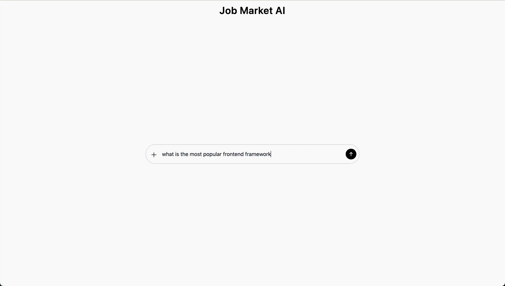

# Job Market AI - Frontend

The frontend of an AI agent that answers tech job market questions using RAG on job postings

Built with React + TailwindCSS, with a focus on replicating ChatGPT's interface as much as possible, providing a seamless experience for users

Built with highly modularized components, allowing for high scalability

> **Demo:**  
> See the animation below for a demonstration of the Job Market AI.

## See

- Backend (GitHub): https://github.com/TomZhang11/Job-Market-AI-Backend
